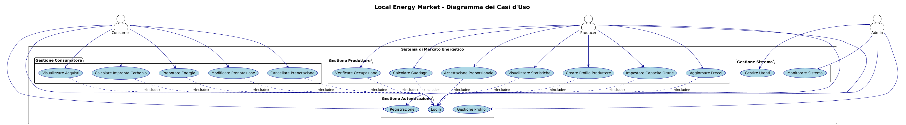
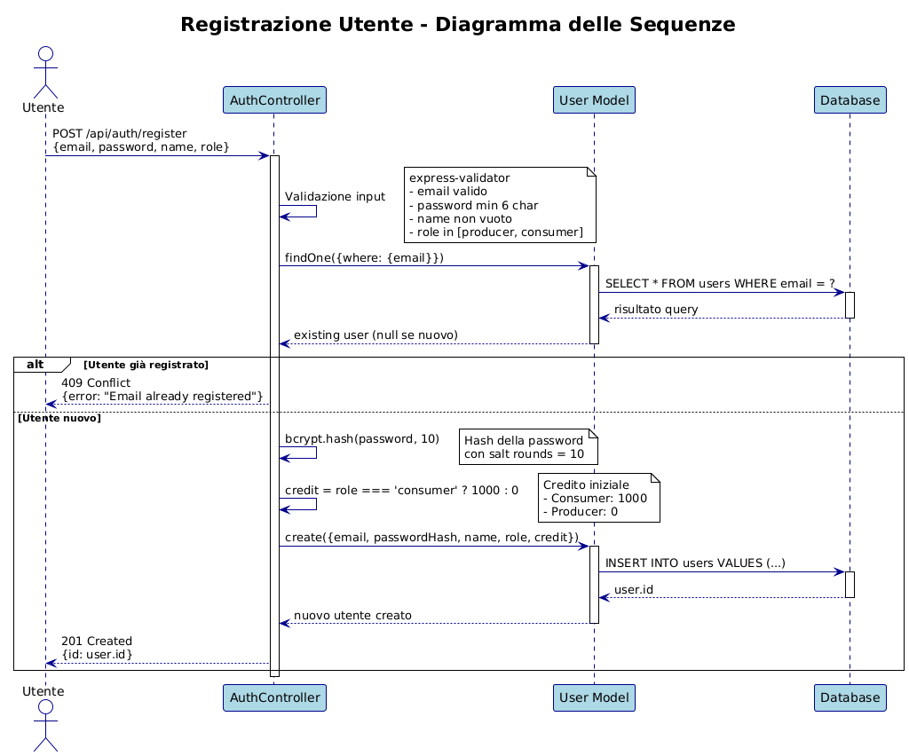
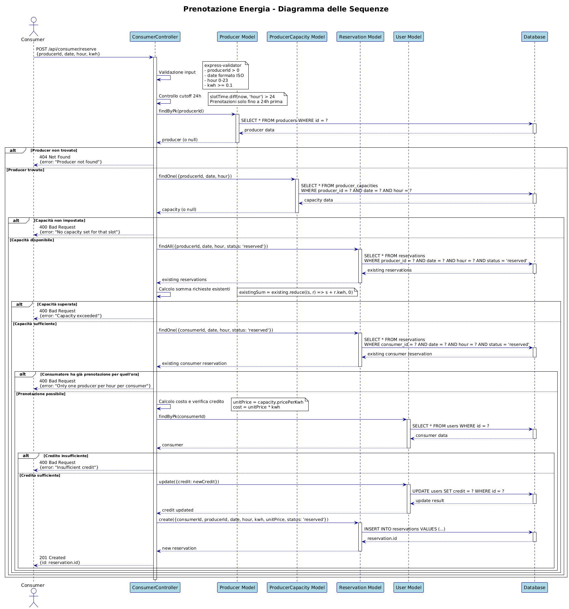
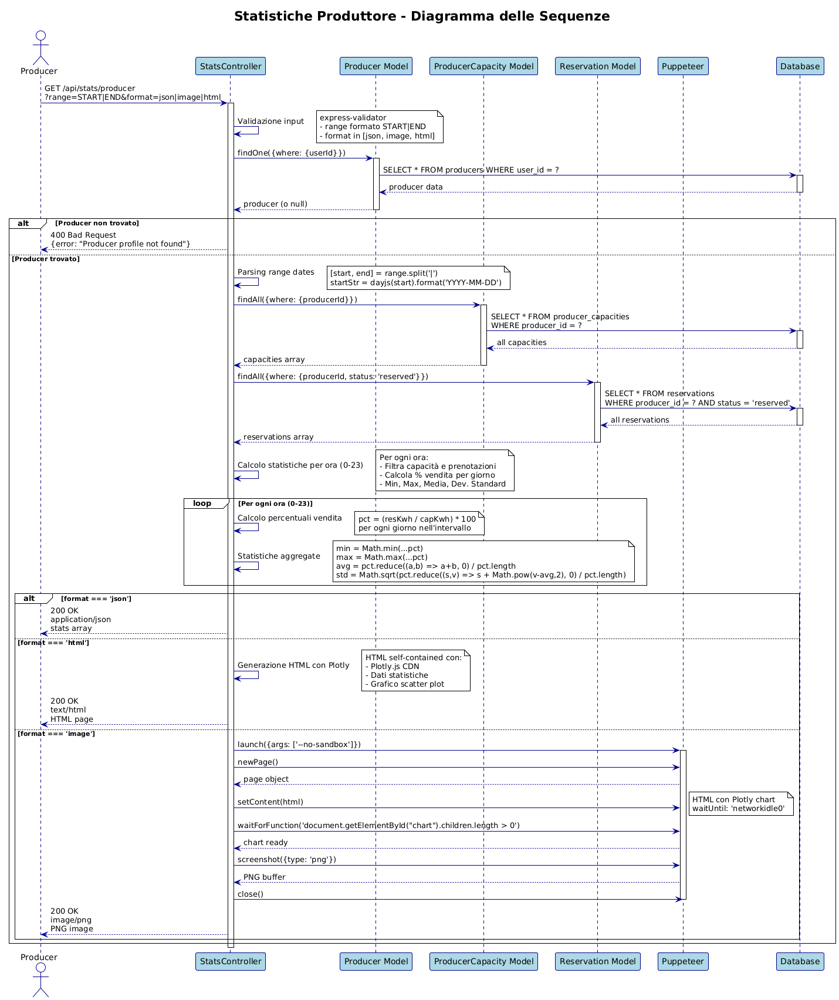

# Local Energy Market API (Node.js + TypeScript)

## Obiettivo
Backend per la gestione della compravendita di energia locale tra produttori e consumatori con:
- Autenticazione JWT con ruoli (`producer`, `consumer`, `admin`)
- Gestione slot orari di 1h per il giorno successivo
- Prenotazioni, modifica/cancellazione con regole (cutoff 24h, min 0.1kWh, unico produttore/ora)
- Occupazione, filtri acquisti, impronta di carbonio
- Statistiche produttore (JSON e immagine via Plotly)
- Calcolo guadagni

## Stack
- Node.js, Express, TypeScript
- Sequelize (Postgres)
- JWT (jsonwebtoken)
- Plotly via headless Chrome (puppeteer)
- Docker + docker-compose

## Setup rapido
1. Prerequisiti: Docker Desktop, Node 18+.
2. Avvio servizi DB+API:
```bash
docker compose up -d --build
```
3. (Opzionale) Seed dati demo (prima avviare il database: `docker compose up -d db`):
```bash
npm run build && npm run seed
```
4. Avvio API localmente (senza Docker) — assicurarsi che il database sia avviato (`docker compose up -d db`):
```bash
npm run build && node dist/server.js
```
Config via env: `PORT`, `DB_HOST`, `DB_PORT`, `DB_NAME`, `DB_USER`, `DB_PASS`, `JWT_SECRET`.

## Endpoints principali
- Auth
  - POST `/api/auth/register` { email, password, name, role }
  - POST `/api/auth/login` { email, password } -> { token }
- Producer
  - POST `/api/producer/profile` { energyType, co2PerKwh, pricePerKwh?, defaultMaxPerHourKwh }
  - POST `/api/producer/capacities` { date, slots:[{hour,maxCapacityKwh,pricePerKwh?}] }
  - POST `/api/producer/prices` { date, slots:[{hour,pricePerKwh}] }
  - GET  `/api/producer/occupancy?date=YYYY-MM-DD&fromHour=..&toHour=..`
  - GET  `/api/producer/earnings?range=YYYY-MM-DD|YYYY-MM-DD`
  - POST `/api/producer/proportional-accept` { date, hour }
- Consumer
  - POST `/api/consumer/reserve` { producerId, date, hour, kwh }
  - POST `/api/consumer/modify` { reservationId, kwh }
  - GET  `/api/consumer/purchases?producerId=&energyType=&range=START|END`
  - GET  `/api/consumer/carbon?range=START|END`
- Stats
  - GET `/api/stats/producer?range=START|END&format=json|image`

Tutte le rotte (tranne `/api/auth/*` e `/health`) richiedono JWT nel header `Authorization: Bearer <token>`.

## Regole di business implementate
- Prenotazione minimo 0.1 kWh
- Un consumatore può acquistare da un solo produttore per la stessa fascia oraria
- Prenotazioni solo fino a 24h prima dello slot
- Cancellazione >24h: rimborso totale; <=24h: nessun rimborso
- Addebito credito al momento della prenotazione; rimborsi automatici su riduzioni proporzionali
- Controllo capacità per slot (somma richieste ≤ capacità)

## Architettura MVC
- Layers: Routes → Controllers → Models (Sequelize)
- Struttura cartelle principale:
  - `src/routes/`: definizione delle rotte Express, solo validazioni e delega ai controller
    - `auth.ts`, `consumer.ts`, `producer.ts`, `stats.ts`, `index.ts`
  - `src/controllers/`: logica applicativa per ciascuna area
    - `authController.ts` (register, login)
    - `consumerController.ts` (reserve, modify, purchases, carbon)
    - `producerController.ts` (upsertProfile, upsertCapacities, occupancy, updatePrices, earnings, proportionalAccept)
    - `statsController.ts` (producerStats)
  - `src/models/`: modelli Sequelize e associazioni (User, Producer, ProducerCapacity, Reservation)
  - `src/middleware/`: 
    - `auth` (JWT + RBAC), 
    - `error` (HttpError, handler globale),
    - `validate` (validazione generica),
    - `authMiddleware`, (middleware che gestisce la validazione dei dati relativi all'autenticazione),
    - `consumerMiddleware`, (middleware che gestisce la validazione dei dati relativi alla sezione dei consumatori),
    - `producerMiddleware`, (middleware che gestisce la validazione dei dati relativi alla sezione dei produttori),
    - `statsMiddleware`, (middleware che gestisce la validazione dei dati relativi alla sezione delle statistiche).

### Linee guida
- Le rotte devono limitarsi a: definire path/metodo, validazioni (express-validator), autenticazione/autorizzazione, e chiamare il relativo controller.
- I controller incapsulano la logica di business e interagiscono con i modelli.
- I modelli rappresentano lo schema e le relazioni dei dati (Postgres via Sequelize).

## Diagrammi UML

Di seguito sono riportati i principali diagrammi UML che illustrano i casi d'uso e le sequence principali del sistema.

### Use Case

_Diagramma dei casi d'uso principali: attori e funzionalità._

### Registrazione (Sequence)

_Sequence diagram per la registrazione di un utente (validazione, controllo esistenza, creazione)._ 

### Prenotazione Energia (Sequence)

_Sequence diagram che mostra il flusso di prenotazione: controllo capacità, addebito credito, creazione prenotazione._

### Statistiche Produttore (Sequence)

_Sequence diagram per la generazione delle statistiche (dati, render HTML/PNG)._ 

## Design e Pattern
- Middleware: `auth` (JWT + RBAC), `error` (HttpError, handler), `validator` (express-validator)
- Pattern utilizzati:
  - Factory Method tramite `findOrCreate` per capacità per slot
  - Strategy potenziale per policy di accettazione richieste (attuale: proporzionale)
  - Repository semplificato via Models Sequelize
  - Singleton tramite la connessione Sequelize, esposta e importata dove serve

## Note Plotly
L’endpoint immagine usa Puppeteer per renderizzare Plotly in headless Chrome e restituisce PNG.

## Test (Postman)
Per eseguire i test della collection:
```bash
# Avviare il database (necessario in entrambi i casi)
docker compose up -d db

# Opzione A: API in Docker (consigliata per test rapidi)
docker compose up -d --build
npm run newman

# Opzione B: API in locale (in un altro terminale)
npm run build && node dist/server.js
# quindi, in questo terminale, eseguire i test
npm run newman
```

Forniremo una collection con:
- Register/Login
- Producer: profile, capacities, prices, occupancy, earnings, proportional-accept
- Consumer: reserve, modify, purchases, carbon
- Stats: producer (json/image)

## Docker
- `docker-compose.yml` avvia Postgres e API
- Variabili DB preconfigurate per sviluppo

## Licenza
MIT
